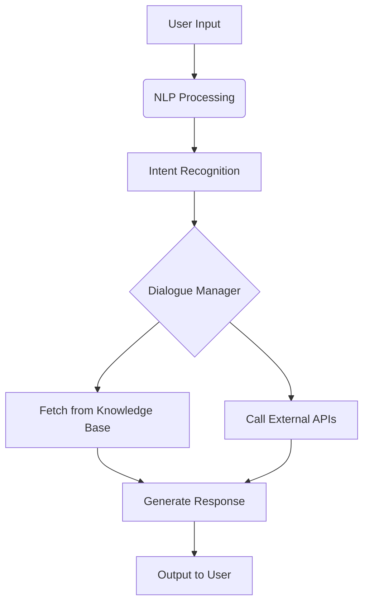

## **🗂️ AI Assistant တစ်ခုတည်ဆောက်ဖို့ လိုအပ်တဲ့ အခြေခံ Structure**
### **1. Core Components (အဓိက အစိတ်အပိုင်းများ)**
| **အစိတ်အပိုင်း**       | **အသေးစိတ်**                                                                 |
|------------------------|------------------------------------------------------------------------------|
| **🗣️ NLP Engine**       | - စာသား/အသံကို နားလည်ခြင်း (Understanding) <br> - သဘာဝဘာသာစကားအဖြေထုတ်ခြင်း (Generation) |
| **🧠 Knowledge Base**   | - အချက်အလက်သိုလှောင်ခြင်း (Databases, APIs, Documents) <br> - မေးခွန်းများအတွက် အဖြေရှာခြင်း |
| **🤖 Dialogue Manager** | - စကားပြောအဆက်အစပ်ကိုထိန်းချုပ်ခြင်း <br> - Context မှတ်သားခြင်း (ဥပမာ - အရင်မေးခွန်းကို မှတ်ထားခြင်း) |
| **🚀 Integration Layer**| - အပြင်အဆင်များနှင့်ချိတ်ဆက်ခြင်း (ဥပမာ - Google Search, Calendar, Payment Gateway) |

---

### **2. လိုအပ်သော နည်းပညာများ**


#### **(၁) NLP (Natural Language Processing)**
- **Tools/Frameworks**:  
  - **Transformer Models** (GPT, BERT, T5) → စာသားနားလည်မှုနှင့် ဖြေဆိုမှု  
  - **Libraries**: HuggingFace `transformers`, SpaCy, NLTK  
  - **Tokenization** → စာကြောင်းများကို AI နားလည်သည့်ပုံစံသို့ပြောင်းခြင်း  

#### **(၂) Knowledge Base & Data**
- **ဒေတာအမျိုးအစား**:  
  - **Structured Data** (SQL Databases, Spreadsheets)  
  - **Unstructured Data** (PDFs, Websites, FAQs)  
- **Search Engine**: Elasticsearch, Vector Databases (FAISS)  

#### **(၃) Backend & Deployment**
- **API Development**: FastAPI, Flask  
- **Cloud Services**: AWS Lambda, Google Dialogflow, Microsoft Bot Framework  
- **Scalability**: Docker, Kubernetes  

---

### **3. တည်ဆောက်ရန် အဆင့်ဆင့်**
#### **📌 အဆင့် ၁: NLP Model ရွေးချယ်ခြင်း**
- **Option 1**: Pre-trained Model (ဥပမာ - GPT-4, Llama 3) ကို Fine-tune လုပ်ပါ။  
- **Option 2**: ကိုယ်ပိုင် Model ဆောက် (RNN/Transformer)။  

#### **📌 အဆင့် ၂: Dialogue Flow ဒီဇိုင်းဆွဲခြင်း**
```python
# Example: Simple Rule-based Dialogue
if "အချိန်ဘယ်လောက်ရှိပြီလဲ" in user_input:
    response = get_current_time()
elif "ရာသီဥတုဘယ်လိုရှိလဲ" in user_input:
    response = fetch_weather_data()
```

#### **📌 အဆင့် ၃: Integration & Testing**
- **API Connections**: Google Search, Wikipedia, Custom Databases  
- **Testing**: Unit Tests, User Feedback Loop  

#### **📌 အဆင့် ၄: Deploy & Monitor**
- **Deployment**: Streamlit/Telegram Bot/Web Interface  
- **Monitoring**: Logs, User Interactions, Performance Metrics  

---

## **🚀 ဘယ်လိုစတင်မလဲ?**
1. **စမ်းသပ်ရန်**:  
   - `ChatGPT API` သို့မဟုတ် `HuggingFace` မှ အခမဲ့ Model များကို အရင်စမ်းပါ။  
2. **ဒေတာစုဆောင်းပါ**:  
   - မေးလေ့ရှိသော မေးခွန်းများနှင့် အဖြေများ (FAQ Pairs)။  
3. **Simple Bot တည်ဆောက်ပါ**:  
   - Python + Flask ဖြင့် Rule-based Chatbot စပါ။  

---

### **📌 သတိထားရန် အချက်များ**
- **Context Memory**: အရင်စကားဝိုင်းကို မှတ်မိဖို့ (ဥပမာ - RAG Architecture)  
- **Ethical AI**: Bias ကင်းစင်သော ဒေတာများသုံးပါ။  
- **Scalability**: User တွေများလာရင် Server Load ခံနိုင်ရည်ရှိပါစေ။  

> **အဆင်ပြေပါစေ!** 🤖✨ ကိုယ်ပိုင် AI Assistant တည်ဆောက်ဖို့ ဒီ Structure ကို အခြေခံပြီး စတင်နိုင်ပါပြီ။
